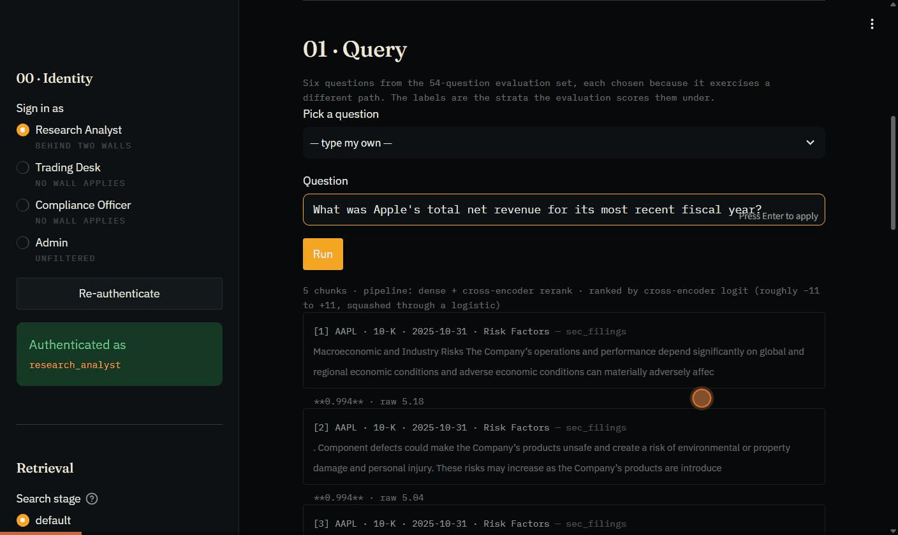

# RAG Enterprise — SEC EDGAR Filing Analyzer

[](https://github.com/Murali-Sai/Rag-enterprise/actions/workflows/ci.yml)

> **Live Demo** &nbsp;|&nbsp; [Query dashboard](https://rag-enterprise-dashboard-laa65asupq-uc.a.run.app) &nbsp;·&nbsp; [Landing page](https://rag-enterprise-laa65asupq-uc.a.run.app) &nbsp;·&nbsp; [API docs](https://rag-enterprise-laa65asupq-uc.a.run.app/docs)
>
> Two Cloud Run services: the API with the filing index shipped inside the image, and the Streamlit dashboard talking to it over HTTP.
>
> **The live demo retrieves exactly as measured, and generates with Gemini.** It serves the same 8,232-chunk index as run `eval_20260809_015503` (digest `c2f8c13673cf5ca5`), embedded with `text-embedding-3-small` — so retrieval, ranking, citation targets and the insufficient-context gate are the measured pipeline, not an approximation of it. The answer *text* comes from Gemini's free tier rather than `gpt-4o`, because the demo is public and unauthenticated and `gpt-4o` would put an uncapped meter on a public URL. Faithfulness and answer relevancy are generator-dependent; read those two as "measured on `gpt-4o`", and run it locally with an OpenAI key to reproduce them.
>
> Until 2026-08-09 the demo also embedded locally with MiniLM over a differently-built 8,099-chunk corpus, which made every retrieval number unreproducible here too. That half is now closed.



*One question traced through the pipeline — RBAC walls, ranked chunks with cross-encoder scores, a cited answer ($416,161M, [1][3]), the confidence composite — then an underspecified question ("the company's main risks?") refused before generation with a structured `ambiguous_entity` report instead of a guess.*

Production-grade Retrieval Augmented Generation system that queries **real SEC 10-K filings** from the EDGAR API. Features role-based access control with information barriers (Chinese Walls), financial compliance guardrails, MNPI detection, regulatory audit trails, and RAGAS evaluation — built for investment banking workflows at firms like **JPMC, Morgan Stanley, and Goldman Sachs**.

Unlike typical RAG demos with synthetic documents, this system downloads, parses, and indexes **actual annual reports** from Apple, JPMorgan, Tesla, Microsoft, and Goldman Sachs.

**Measured, not asserted** — 54 hand-written evaluation questions over an 8,232-chunk index, three-run baseline:

| Faithfulness | Citation Accuracy | Refusal Correctness | Correct refusals on unanswerable questions |
|:---:|:---:|:---:|:---:|
| **0.85** | **0.94** | **0.98** | **16/16** |

Every number has a noise floor, several published claims are retractions of earlier ones, and the negative results stay in [CASE_STUDY.md](CASE_STUDY.md) on purpose — they are why the remaining numbers are believable. (Refusal correctness 0.98 is one confirming run after the ambiguity fix; the three-run mean before it was 0.94.)

## Architecture

```
                          ┌─────────────────────────────────────────────────┐
                          │              SEC EDGAR API                      │
                          │   (Real 10-K filings for AAPL, JPM, TSLA,      │
                          │    MSFT, GS — downloaded & parsed)              │
                          └────────────────────┬────────────────────────────┘
                                               │
                               Download & Parse (BeautifulSoup + regex)
                               Extract: Item 1, 1A, 7, 7A, 8
                                               │
                                               ▼
[User + JWT] → FastAPI → Input Guardrails → RBAC Retriever → LLM → Financial Compliance → Audit Trail → Response
                              │                   │                       │
                          Auth (SQLite)      ChromaDB                MNPI Detection
                                             (metadata              Investment Advice Check
                                              filtering)            Disclaimer Injection
```

### What Makes This Different

1. **Real SEC Filings**: Downloads actual 10-K annual reports from the SEC EDGAR API — not synthetic documents. Queries return real revenue figures, risk disclosures, and financial data.

2. **10-K Section Parsing**: Custom HTML parser extracts Item 1 (Business), Item 1A (Risk Factors), Item 7 (MD&A), Item 7A (Market Risk), and Item 8 (Financial Statements) from raw EDGAR HTML, handling formatting variations across filers.

3. **Cross-Company Analysis**: "Compare JPMorgan and Goldman Sachs credit risk disclosures" retrieves from multiple filings and synthesizes a comparison with section citations.

4. **Information Barriers (Chinese Walls)**: Research analysts cannot access trading or compliance data — enforced at the vector store layer via ChromaDB `where` clauses (SEC Rule 15g-1, FINRA Rule 2241).

5. **Financial Compliance Guardrails**: Automatic detection of investment advice language, MNPI leakage, and forward-looking statements. Prohibited patterns are blocked and logged.

6. **Regulatory Audit Trail**: Every query, document access, and RBAC decision is logged to append-only JSONL (SEC Rule 17a-4, FINRA 4511).

7. **Verifiable Citations**: Answers cite numbered context blocks (`[2]`), so every claim can be paired back with the exact chunk it came from and judged against it. Prose citations read better and cannot be checked — which is why citation accuracy is a metric here rather than an aspiration.

8. **Confidence Scoring and a Structured "I don't know"**: Every answer carries a composite of retrieval relevance, citation coverage, and answer completeness. Below a retrieval-confidence threshold the system returns what it searched and which filings to read by hand, instead of an answer built on chunks it does not trust. That threshold is a measured cost guard rather than the refusal mechanism — the model, not the gate, is what makes refusals correct, and the measurement showing it is below.

9. **Evaluation**: 54 hand-written questions across seven strata, measuring Faithfulness, Answer Relevancy, Context Precision, and Context Recall — plus citation accuracy, coverage, and refusal correctness, computed outside RAGAS. Sixteen of the 54 correctly have no answer and are scored on whether the system declines.

10. **A Dashboard for the Pipeline, Not the Answer**: a Streamlit client that traces one question through six stages — the departments the role could search and the walls that removed the rest, the ranked chunks with their raw and normalised scores, the answer with its citations, the per-claim verdicts, the confidence breakdown, and every guardrail that fired. Switching roles re-runs the same question behind a different barrier; a comparison mode runs it through dense and hybrid retrieval side by side.

## Demo Companies

| Ticker | Company | Why |
|---|---|---|
| AAPL | Apple Inc. | Clean filings, well-known financial metrics |
| JPM | JPMorgan Chase | Target employer — demonstrates domain knowledge |
| TSLA | Tesla Inc. | Complex risk factors, high-profile filings |
| MSFT | Microsoft Corp. | AI/cloud narrative, enables AAPL comparison |
| GS | Goldman Sachs | Second IB — enables JPM vs GS comparison |

Each company's most recent 10-K is downloaded, parsed into 5-6 sections, and chunked — 8,232 vectors across the five filings (460 for Apple's compact filing up to 3,122 for JPMorgan's).

## Tech Stack

| Component | Technology |
|---|---|
| Orchestration | LangChain + LCEL |
| Data Source | SEC EDGAR API (real 10-K filings) |
| Filing Parser | BeautifulSoup + regex section extraction |
| LLM (Primary) | OpenAI `gpt-4o` |
| LLM (Fallback) | Google Gemini 2.5 Flash / Groq llama-3.3-70b — free tiers, set `LLM_PROVIDER` |
| Embeddings | OpenAI `text-embedding-3-small` (1536-dim, 8k-token window); `EMBEDDING_PROVIDER=huggingface` swaps in local all-MiniLM-L6-v2 |
| Chunking | Three switchable strategies: fixed-size (baseline), recursive/structure-aware (default), semantic (embedding-similarity breakpoints) |
| Deduplication | Cosine > 0.95 near-duplicate suppression at ingestion — 7.8% of this corpus |
| Query Transform | HyDE — optional hypothetical-document rewrite before retrieval |
| Hybrid Search | BM25 (`rank_bm25`) fused with dense retrieval via Reciprocal Rank Fusion |
| Reranking | cross-encoder/ms-marco-MiniLM-L-6-v2 — retrieves top-20, reranks to top-5 |
| Vector Store | ChromaDB (the measured index ships inside the image, so cold starts don't ingest — and the deployment answers off the corpus the scores describe) |
| API | FastAPI with async lifespan |
| Auth | JWT + SQLAlchemy + bcrypt |
| Financial Guardrails | MNPI detection, investment advice blocking, disclaimer injection |
| Audit Trail | Append-only JSONL (SEC 17a-4 / FINRA 4511) |
| Evaluation | RAGAS (Faithfulness, Relevancy, Precision, Recall) |
| Deployment | Google Cloud Run — two services (API + Streamlit dashboard) |
| Infrastructure | Terraform + AWS ECS Fargate (reference architecture) |
| CI/CD | GitHub Actions |

## Quick Start

### Prerequisites

- Python 3.11+
- An [OpenAI API key](https://platform.openai.com/api-keys) for the defaults (`gpt-4o` generation,
  `text-embedding-3-small` embeddings)
- Or run it free: set `LLM_PROVIDER=groq` (or `gemini`) with a key from
  [Groq](https://console.groq.com/) / [Google AI Studio](https://aistudio.google.com/), and
  `EMBEDDING_PROVIDER=huggingface` to embed locally. The embedding switch changes vector
  dimensionality, so re-ingest with `python scripts/ingest_edgar.py --from-disk --reset`.

### Setup

```bash
git clone https://github.com/Murali-Sai/Rag-enterprise.git
cd rag-enterprise
pip install -e ".[dev,eval]"

cp .env.example .env
# Edit .env — add your GROQ_API_KEY and optionally EDGAR_USER_AGENT
```

### Download Real SEC Filings & Run

```bash
make demo       # Seeds users + downloads 10-K filings from EDGAR + ingests into ChromaDB
make dev        # Starts FastAPI server at http://localhost:8000
make dashboard  # Starts the Streamlit dashboard at http://localhost:8501 (needs the API up)
```

Or both in containers, which is the path a reviewer should take:

```bash
make docker-up  # API on :8000, dashboard on :8501, index baked in at build time
```

Or run each step individually:

```bash
make seed               # Create demo users
make download-filings   # Download 10-K filings from SEC EDGAR API
make ingest-edgar       # Parse filings and ingest into ChromaDB
make dev                # Start the server
```

### Demo: Query Real SEC Filings

```bash
# 1. Login as a research analyst
TOKEN=$(curl -s -X POST http://localhost:8000/auth/token \
  -H "Content-Type: application/json" \
  -d '{"username": "research_analyst", "password": "research1!"}' | jq -r .access_token)

# 2. Ask about Apple's revenue (real data from 10-K Item 7 MD&A)
curl -s -X POST http://localhost:8000/query \
  -H "Authorization: Bearer $TOKEN" \
  -H "Content-Type: application/json" \
  -d '{"question": "What was Apple total net revenue for fiscal year 2024?"}'
# -> Returns actual revenue figure from Apple's 10-K filing

# 3. Cross-company comparison
curl -s -X POST http://localhost:8000/query \
  -H "Authorization: Bearer $TOKEN" \
  -H "Content-Type: application/json" \
  -d '{"question": "Compare JPMorgan and Goldman Sachs credit risk disclosures"}'
# -> Synthesizes from JPM and GS 10-K Item 1A Risk Factors
```

### Demo: Information Barrier in Action

```bash
# Research analyst CANNOT access trading desk procedures (Chinese Wall)
curl -s -X POST http://localhost:8000/query \
  -H "Authorization: Bearer $TOKEN" \
  -H "Content-Type: application/json" \
  -d '{"question": "What are the daily P&L stop-loss limits?"}'
# -> "No relevant documents found for your query within your access level."

# Trader CAN access trading docs
TRADE_TOKEN=$(curl -s -X POST http://localhost:8000/auth/token \
  -H "Content-Type: application/json" \
  -d '{"username": "trader_desk", "password": "trade1234!"}' | jq -r .access_token)

curl -s -X POST http://localhost:8000/query \
  -H "Authorization: Bearer $TRADE_TOKEN" \
  -H "Content-Type: application/json" \
  -d '{"question": "What are the daily P&L stop-loss limits?"}'
# -> Returns trading desk procedures
```

### Demo Users

| Username | Password | Role | Access |
|---|---|---|---|
| admin_user | admin1234! | admin | All departments |
| trader_desk | trade1234! | trading | Trading, Risk, SEC |
| risk_analyst | risk12345! | risk | Risk, Trading, SEC, Compliance |
| compliance_officer | compl1234! | compliance | Compliance, SEC, Risk |
| research_analyst | research1! | research | Research, SEC **(Chinese Wall)** |
| wealth_advisor | wealth123! | wealth_management | Research, SEC |
| ops_manager | ops1234567! | operations | Trading, Compliance |
| external_auditor | audit1234! | auditor | Compliance, SEC |
| viewer_user | viewer123! | viewer | SEC Filings only |

### API Surface

Read from the OpenAPI schema rather than the route decorators — `main.py` includes its routers lazily, so `app.routes` does not show them and grepping for `@router.post` misses the `/auth` prefix.

| Method | Path | Notes |
|---|---|---|
| `POST` | `/auth/token` | Login → JWT bearer. Not `/auth/login`. |
| `POST` | `/auth/register` | |
| `GET` | `/access` | Roles, accessible departments, barriers in force. No LLM call. |
| `POST` | `/query` | Answer, citations, confidence, sources with scores, refusal report. Takes `retrieval_mode`. |
| `GET` | `/documents` | What is indexed, filtered by the caller's access |
| `POST` | `/documents/ingest` | Admin only |
| `GET` | `/documents/supported-types` | Loader extensions, not indexed content |
| `GET` | `/health`, `/health/ready` | |
| `GET` | `/admin/users` | |
| `GET` | `/`, `/docs`, `/redoc`, `/favicon.svg` | Landing page and branded docs |
| `POST` | `/v1/ask` | Alias of `/query` — the name Project 6 §5.1 gives it |
| `GET` | `/v1/documents` | Alias of `/documents` |
| `POST` | `/v1/ingest` | Alias of `/documents/ingest` |

The `/v1` routes are aliases over the same handlers (`src/api/routes/v1.py`), not a second implementation, and the unversioned paths stay because the dashboard, the landing page and every example in this file use them.

**They share a rate-limit bucket, and that took more than delegation.** slowapi keys a limit on the *request path*, so an alias that merely calls the decorated handler gets its own budget: measured, 21 requests alternating between `/query` and `/v1/ask` all returned 200 against a 20/minute limit, because each path had spent only half of it. Adding an endpoint name would have quietly doubled what one client can spend on the only route that reaches an LLM. Both routes now carry `@limiter.shared_limit(..., scope="query")` and delegate to an undecorated `answer_query`, so each request is charged once against one bucket.

## SEC EDGAR Integration

### How It Works

1. **Download**: `EdgarClient` fetches 10-K filings from `efts.sec.gov` using CIK numbers, respecting the SEC's 10 req/sec rate limit
2. **Parse**: `parse_10k_sections()` uses regex to find section boundaries (handles `Item 7`, `ITEM 7.`, `<b>Item 7` variants) and BeautifulSoup for HTML-to-text conversion with table preservation
3. **Load**: Each section becomes a LangChain `Document` with metadata (ticker, filing_date, section_id, section_name, department)
4. **Chunk**: One of three switchable strategies, with the strategy, per-document chunk index, and character count recorded on every chunk
5. **Deduplicate**: Near-duplicates suppressed before insertion (cosine > 0.95)
6. **Index**: ChromaDB with metadata filtering — RBAC and section queries at the database level
7. **Retrieve**: Hybrid + rerank pipeline — dense embedding search and a BM25 lexical index each return candidates (both RBAC-filtered), fused by Reciprocal Rank Fusion, then rescored by a `cross-encoder/ms-marco-MiniLM-L-6-v2` reranker and cut to the top-5 sent to the LLM

### Chunking Strategies

Chunking is baked into an index at ingestion time, so these are not runtime switches — comparing them means building one collection per strategy and pointing the eval at each. Every chunk records which strategy produced it, so a collection can't be misattributed later.

| Strategy | Splits on | Why it exists |
|---|---|---|
| `fixed` | Character count only | The structure-blind baseline. Cuts through sentences, table rows, and dollar figures. Present to be beaten — it's what makes "structure awareness helps" a measured claim instead of an assumed one |
| `recursive` *(default)* | Paragraph → line → sentence → word → character | Stacks on the EDGAR parser, which has already split the filing at Item boundaries, so a chunk stays inside one section |
| `semantic` | Where consecutive sentence embeddings diverge | Cuts where the subject changes rather than where the budget runs out. Hand-implemented (~50 lines) — `langchain-experimental` requires `langchain-core` 1.x against this project's deliberate `<1.0` pin, and is sunset |

**All three, measured on the same 54-question suite, generator and judge.** Means over two runs per strategy, three for `recursive`. The baseline was not beaten:

> Measured on the **pre-fix pipeline**. The `recursive` row here is the old baseline rather than the 0.853 headline above, because `fixed` and `semantic` have not been re-run against the entity fixes or the recalibrated gate. Substituting the new figures would compare three chunking strategies across two different pipelines. Valid against itself only.

| Strategy | Chunks | Faithfulness | Answer Relevancy | Context Precision | Context Recall | Citation Accuracy |
|---|---|---|---|---|---|---|
| `recursive` *(default, n=3)* | 8,232 | 0.697 | 0.681 | 0.391 | 0.338 | **0.928** |
| `fixed` *(n=2)* | 6,585 | **0.790** | **0.690** | **0.474** | **0.468** | 0.883 |
| `semantic` *(n=2)* | 8,936 | 0.781 | 0.646 | 0.430 | 0.360 | 0.915 |
| *widest spread across strategies* | | *0.034* | *0.004* | *0.035* | *0.044* | *0.017* |

`fixed` beats the shipped default on faithfulness (+0.093), context precision (+0.082) and context recall (+0.130) — 2.3–3.0× the run-to-run noise. `recursive` keeps citation accuracy, +0.045 at 2.6×, which its larger paragraph-aligned chunks plausibly explain: a cited claim more often sits whole inside one chunk.

**Until 2026-08-10 this table read 19×, 22× and 8×.** The deltas were right; the floors were measured on one strategy's pair and transferred to the others. Measured per strategy they are 5–9× wider, and re-scoring against the widest observed spread turns a rout into a 2–3× effect. Two deltas the earlier table counted — refusal correctness and answer correctness — are now inside the noise entirely.

The default stays `recursive`: the trade is 0.045 of citation accuracy, the strongest number here, against 0.08–0.13 elsewhere, and at 2–3× the noise that does not justify invalidating the shipped index, its digest, the deployment and every published figure. Strategy and corpus still can't be separated (a chunking change rebuilds the index). See `CASE_STUDY.md` for the full re-scoring.

### Deduplication — 7.8% of this corpus is redundant

A duplicate chunk is not just wasted disk. Retrieval returns a fixed `top_k`, so an indexed duplicate competes for one of those slots and wins it — the chunk it displaces is by definition the next most relevant thing the model would have seen. Duplication is paid for in context the LLM never gets.

Measured on the live 9,572-chunk index with `scripts/analyze_duplicates.py` (read-only, reuses stored vectors, costs nothing):

| Cosine threshold | Chunks | Share |
|---|---|---|
| ≥ 0.90 | 1,043 | 10.90% |
| **≥ 0.95** (default) | **747** | **7.80%** |
| ≥ 0.98 | 567 | 5.92% |
| ≥ 0.999 (near-identical) | 242 | 2.53% |

Two distinct causes, and the examples make them legible. Page furniture becomes its own chunk — `"Apple Inc. | 2025 Form 10-K | 3"` against `"...| 2025 Form 10-K | 2"` at cosine 0.990, carrying no content whatsoever. And filings genuinely restate themselves: the same supply-chain risk paragraph appears twice at cosine 1.0000, because a disclosure made in Item 1A is repeated verbatim in the incorporated annual report.

The threshold is deliberately high. Two chunks discussing the same topic in different words sit near 0.90; dropping those would be a silent recall loss, which is a worse failure than the one being fixed. Every suppression records what it matched and how closely, so the choice is auditable rather than taken on trust.

Comparison is done on raw vectors rather than a vector-store distance score: Chroma's default metric is L2 and LangChain's "relevance score" is a metric-dependent rescaling of distance, so comparing that against a cosine threshold quietly means something different depending on how the collection was created.

### Parsed Sections

| Section | Content | Use Case |
|---|---|---|
| Item 1 — Business | Company overview, segments, products | Business analysis |
| Item 1A — Risk Factors | Risk disclosures, regulatory risks | Risk assessment |
| Item 7 — MD&A | Revenue, margins, segment performance | Financial analysis |
| Item 7A — Market Risk | Interest rate, FX, derivative exposures | Market risk |
| Item 8 — Financial Statements | Balance sheet, income statement, cash flow | Fundamentals |

## RBAC Model — Investment Bank Structure

```
                                admin (CRO / CEO)
                                |  Full access
                ┌───────────────┼───────────────┐
                |               |               |
          ┌─────┴─────┐   ┌────┴────┐   ┌──────┴──────┐
          |  Trading  |   |  Risk   |   | Compliance  |
          |  Desk     |   | Mgmt    |   | & Legal     |
          └─────┬─────┘   └────┬────┘   └──────┬──────┘
                |               |               |
          ══════╪═══════════════╪═══════════════╪══════════  <- Chinese Wall
                |               |               |
          ┌─────┴─────┐   ┌────┴────┐   ┌──────┴──────┐
          | Research  |   | Wealth  |   | Operations  |
          | (Blocked) |   | Mgmt    |   | (Back Off.) |
          └───────────┘   └─────────┘   └─────────────┘
```

## Guardrails

| Layer | Purpose | Financial Relevance |
|---|---|---|
| Input Validation | Block SQL/XSS, enforce length | Standard security |
| Prompt Injection | Detect "ignore instructions" attacks | Prevent social engineering |
| **MNPI Detection** | Flag potential insider information leakage | SEC Rule 10b-5 |
| **Investment Advice** | Detect buy/sell recommendations | SEC/FINRA suitability rules |
| **Forward-Looking** | Flag projections and forecasts | SEC safe harbor requirements |
| PII Redaction | Redact SSN, credit cards | GLBA / GDPR compliance |
| Output Safety | Flag hallucinations, unsafe content | Accuracy in financial context |

### Rate limiting

`POST /query` is capped at **20/minute per IP** and the two auth routes at **30/minute**, with `X-RateLimit-*` and `Retry-After` on every limited response.

Three things about that are deliberate. **It is not a blanket limit** — the landing page pulls three assets and a favicon per load, so a global cap would spend a visitor's budget on stylesheets and lock them out of the demo they came to try; static files and `/health` are unlimited. **Auth is looser than query**, which looks backwards until you watch someone use it: switching roles *is* the demonstration, the page logs in once per role click, and the demo credentials are published anyway, so throttling guesses at those five accounts protects nothing. **The key is the first `X-Forwarded-For` hop**, because behind Cloud Run `request.client.host` is Google's front end for every visitor on earth and keying on it would put the whole internet in one bucket. That header is spoofable, and that trade is made knowingly: the limit exists to stop casual scripted abuse running up a bill on a public unauthenticated demo, not to stop a determined attacker who was never going to be stopped by a per-IP counter.

Until 2026-08-10 this was configured and inert. `rate_limit = "20/minute"` sat in settings, a `Limiter` was built and attached to `app.state`, and nothing consulted it — no middleware, no decorated route. Forty consecutive requests against the deployment returned zero 429s. It is now enforced, and `tests/unit/test_rate_limit.py` pins both halves: that the expensive routes refuse, and that the demo stays usable while they do.

`POST /documents/ingest` is separately capped at 10 MB, counted as bytes are written rather than read off `Content-Length`, which a caller can lie about.

One coupling to know before changing anything: the counter is **in-memory and per process**, so these are per-instance limits. The service runs `maxScale = 1`, which is the only reason they are exact. Raising maxScale to N multiplies every limit by N silently — nothing errors, nothing logs, the numbers just stop meaning what they say — and fixing that needs shared storage for the limiter, not a bigger number.

Verified against revision `rag-enterprise-00008-fzj`: the 31st login returns 429, twelve asset loads return 200 while that same address is locked out, and the Cloud Run log records the limit against the real client IP rather than the `169.254.169.126` front end every visitor shares.

## Generation, Citations, and Confidence

The quality layer most RAG systems skip. Four pieces, each of which exists because the one before it made the next measurable.

**Bracketed citations.** Context blocks are numbered `[1] (Source: …, Company: AAPL, Section: Item 1A …)` and the prompt requires every factual sentence to end with the block it came from. The previous prompt asked for prose citations — *"According to Apple's 2024 10-K, Item 7 MD&A…"* — which read better and could not be parsed, so no claim could be paired with its source and no citation metric could exist.

**Citation verification** (`src/generation/verification.py`). Each answer is split into sentence-level claims, and each `(claim, cited block)` pair goes to a judge with *only* that block. Showing the whole context would turn this into a faithfulness check — the citation would pass because the corpus supports the claim, not because the cited chunk does. Three outcomes are kept distinct rather than pooled as "unverified":

| | What it means | Where it shows up |
|---|---|---|
| Unsupported | The cited chunk does not say that | `citation_accuracy` |
| Out of range | `[7]` when 5 blocks were supplied — an invented source | `out_of_range`, and scored zero |
| Uncited | A claim naming no source at all | `citation_coverage`, not accuracy |

Off by default at runtime (one LLM call per citation, on the critical path); the eval harness forces it on, which is where the cost buys the metric.

**Confidence scoring** (`src/generation/confidence.py`) — a 0.5/0.3/0.2 composite of retrieval relevance, citation coverage, and answer completeness. Retrieval leads because a fluent, fully-cited answer over bad chunks is the failure mode that is invisible in the answer text — the measured reranker regression below is exactly that. Getting this signal out required a change underneath: `rerank_documents()` computed cross-encoder scores and then discarded them, so `src/retrieval/scores.py` now carries them through the pipeline tagged with which stage produced them. Scores that carry no relevance (RRF fuses ranks and throws scores away) report `None`, never `0.0` — an unmeasurable signal must not read as a bad one.

**Structured "I don't know"** (`src/generation/insufficient.py`). Below `INSUFFICIENT_CONTEXT_THRESHOLD` the system returns the passages it consulted and the filings worth opening manually, *before* spending a generation call. The same structure is attached when the model itself declines over good retrieval — a different failure, pointing at a corpus or chunking gap rather than a retrieval one.

**One bounded agentic retry** (`src/generation/agent.py`). Three things make this system decline and only one deserves a second look. `ambiguous_entity` is decided mechanically before generation and is correct. `low_retrieval_confidence` means nothing scored above the gate, so there is nothing to re-read. `model_refused` — retrieval cleared the gate and the model still declined — is the one where a differently-phrased search might land somewhere better, so the loop runs there and nowhere else.

Two tools: `search_filings(query)` re-runs retrieval on a rephrased query, and `list_sections(ticker)` is a metadata-only lookup of what is indexed for a company. The search callable is **injected by the caller** rather than built inside the module, so the retry inherits the RBAC and information-barrier scope already resolved for that user and cannot widen it.

Bounded three ways, because an unbounded agent is a billing incident:

| Bound | Setting | What it stops |
|---|---|---|
| Model turns | `AGENT_MAX_ITERATIONS` (2) | A model that keeps calling tools and never answers |
| Tool failures | `AGENT_MAX_TOOL_ERRORS` (2) | A loop retrying into a wall — a vector store that is down stays down |
| Provider support | — | A provider that cannot bind tools degrades to "no recovery attempted" instead of raising |

Tool exceptions become *observations the model can react to*, never propagated: a traceback there would turn a refusal — which is a valid answer — into a 500. And the loop **fails closed**: anything short of a non-refusal answer leaves the original refusal exactly as it was, and a recovered answer is re-parsed and re-verified against the passages the agent's own search returned, since its citations are numbered against that set and not the first attempt's.

All of it lives behind `generate_grounded_answer()` in `src/generation/answer.py`, which the REST API, the MCP server, and `evaluation/run_evaluation.py` all call. The eval harness bypasses the API route entirely, so anything implemented in the route would be invisible to the measurement meant to prove it works.

## Query Dashboard (Streamlit, port 8501)

A screen for the pipeline, not for the answer. The choice was between an analyst tool — ask, read, click a citation, trust the result — and a demonstration of how the answer was produced. The distinctive things in this repo are the information barrier, the citation verdicts and the structured refusal, and none of them are visible in a screen that optimises for reading one answer, so the dashboard traces a single question through six stages:

| Stage | What it shows | Where the data comes from |
|---|---|---|
| 00 Identity | Departments this role may search; the Chinese Walls in force, with the departments each removes | `GET /access` — no LLM call, so switching roles is free |
| 01 Query | Six questions from the evaluation set, labelled with the stratum each exercises, and the dense/hybrid toggle | `retrieval_mode` on the request |
| 02 Retrieval | The ranked chunks, each with its normalised relevance, its raw score, and the stage that produced it | `sources[].relevance_score`, `.raw_score`, `.score_type`, and `retrieval` |
| 03 Answer **or** Declined | The answer with its citations, or the structured refusal | `answer`, `claims`, `unanswered` |
| 04 Citations | Each claim, the blocks it cites, and the verdict where verification ran | `claims[].verdict` |
| 05 Confidence | All four components with the label, never the composite alone | `confidence` |
| 06 Guardrails | Every flag that fired | `guardrail_flags` |

It runs as its own process and its own container, holding no retrieval logic, no scoring and no thresholds — if a number appears on it, it came off a response body.

```bash
make dashboard     # http://localhost:8501, expects the API on :8000
```

**Hybrid vs. dense, side by side.** The sidebar pins the search stage per request — `dense`, `hybrid`, or a comparison mode that asks the same question both ways and renders the two pipelines in adjacent columns. On the Apple revenue question, hybrid promotes the correct net-sales table from rank 3 to rank 2; both leave a Goldman Sachs chunk wrongly at rank 1, which is the reranker defect below. Across the whole evaluation set the difference is inside the noise floor — the comparison exists so that claim can be checked rather than taken on trust.

Three rules the markup exists to keep:

**A refusal is not an error state.** It scores 1.000 on all three unanswerable strata; rendering it in red with a warning triangle would tell the reader the opposite of what the measurement says. It gets its own neutral treatment, and the panel distinguishes `low_retrieval_confidence` (the gate fired, nothing was sent to the model) from `model_refused` (retrieval cleared its threshold and the model still declined) — the one signal a user can act on, because the two point at different fixes.

**No number without its scale.** `confidence.overall` never appears without its label; a null retrieval score renders as *unavailable* rather than as zero, with the note that its weight was redistributed; a chunk's relevance sits next to the raw score and the name of the stage that produced it. The reranker's negative logits are visible here as a matter of course — a chunk at raw −2.35 normalising to 0.087 is the defect described below, on screen.

**Nothing is precomputed.** The template is a shell. A test asserts no score is baked into it, because a number in the markup is a number nobody measured.

Role switching is the point. Ask *"What pre-trade controls does ACME Financial Holdings' internal trading desk procedures manual set?"* as `research_analyst` and the query declines at the retrieval gate with the Research-Trading Wall shown in force; the "same question, different role" control re-runs it as `trader_desk`, where the same question answers at 0.877 confidence off `trading_desk_procedures.txt`. The wall is the only thing that changed.

`POST /query` grew fields to make this possible: `information_barriers` (name, description, blocked departments), `accessible_departments`, per-chunk `relevance_score`/`raw_score`/`score_type`, and `retrieval` reporting the stages that actually ran. The first two were already computed and then flattened into a single `guardrail_flags` string; the string stays, because it is what the 17a-4 audit trail already records.

`GET /documents` lists what is indexed, filtered by the same where-clause retrieval uses — a research analyst sees 9 documents and 8,162 chunks, an admin sees 14 and 8,232. The five it cannot see are the walled ones.

The landing page remains a Jinja2 template in `src/web/`, served by the API.

## Compliance Audit Trail

Every query generates an audit log entry:

```json
{
  "event_type": "rag_query",
  "timestamp": "2025-01-15T14:30:22.123Z",
  "user_id": 3,
  "username": "research_analyst",
  "user_roles": ["research"],
  "query": "What was Apple's total revenue in fiscal year 2024?",
  "retrieved_departments": ["sec_filings"],
  "documents_accessed": 5,
  "guardrail_flags": ["forward_looking_statement"],
  "information_barriers_applied": ["Research-Trading Wall", "Research-Compliance Wall"],
  "response_length": 342
}
```

## MCP Server (Model Context Protocol)

The RAG pipeline is also exposed as an **MCP server**, so any MCP-compatible LLM client (Claude Desktop, Cursor, etc.) can invoke the tools natively — no REST calls, no copying tokens. The same RBAC department filtering, Chinese Wall information barriers, and financial-compliance guardrails used by the REST API are preserved.

### Tools exposed

| Tool | Description |
|---|---|
| `query_sec_filings(question, role)` | RAG query over real 10-K filings, RBAC-scoped to the role |
| `compare_companies(ticker_a, ticker_b, topic, role)` | Cross-company comparison (e.g. JPM vs GS credit risk) |
| `list_indexed_companies()` | List indexed companies and queryable 10-K sections |
| `describe_access(role)` | Show a role's accessible departments + active Chinese Walls |

### Run it

```bash
make mcp          # stdio transport (for Claude Desktop / Cursor)
make mcp-http     # streamable-HTTP transport on :8001 (for remote clients)
```

### Connect to Claude Desktop

Copy the `sec-edgar-rag` block from [`claude_desktop_config.example.json`](claude_desktop_config.example.json) into your Claude Desktop config (adjust the absolute paths and API key), then restart Claude Desktop. You can then ask Claude *"What was Apple's revenue in FY2024?"* and it will call `query_sec_filings` and answer from the real filing — with a `research` role walled off from trading/compliance documents.

Architecturally this turns the project into a **reusable AI capability**: the domain work (real SEC filings, RBAC, guardrails) is consumed by *any* agent via the open MCP standard, not just this app's own UI.

## Project Structure

```
rag-enterprise/
├── src/
│   ├── main.py                          # FastAPI app + landing page route
│   ├── config.py                        # Settings (inc. EDGAR config)
│   ├── web/                             # Server-rendered landing page
│   │   ├── templates/                   # base, landing (Jinja2)
│   │   └── static/                      # tokens.css + landing css/js
│   ├── api/
│   │   ├── routes/                      # auth, access, query, documents, health, admin
│   │   ├── audit.py                     # Compliance audit trail (SEC 17a-4)
│   │   └── middleware.py                # Rate limiting, request logging
│   ├── auth/
│   │   ├── rbac.py                      # Information barriers + role access map
│   │   ├── jwt_handler.py               # JWT creation/validation
│   │   └── repository.py               # User/Role CRUD
│   ├── edgar/                           # << NEW: SEC EDGAR integration
│   │   ├── client.py                    # Async EDGAR API client with rate limiting
│   │   ├── parser.py                    # 10-K HTML section extractor
│   │   └── loader.py                    # LangChain Document adapter
│   ├── ingestion/                       # Chunking, metadata, EDGAR pipeline
│   ├── retrieval/
│   │   ├── vector_store.py              # ChromaDB / OpenSearch abstraction
│   │   ├── retriever.py                 # RBAC-filtered retriever
│   │   └── scores.py                    # Relevance scores carried through the pipeline
│   ├── generation/
│   │   ├── answer.py                    # Entry point: API, MCP and eval all call this
│   │   ├── prompts.py                   # Finance prompts, bracketed-citation rules
│   │   ├── citations.py                 # Claim segmentation + [n] parsing
│   │   ├── verification.py              # LLM-as-judge citation checking
│   │   ├── confidence.py                # Composite confidence score
│   │   └── insufficient.py              # Structured "I don't know"
│   ├── guardrails/                      # MNPI, prompt injection, PII, compliance
│   ├── mcp_server/                      # << NEW: MCP server exposing RAG as tools
│   └── common/                          # Logging, exceptions, schemas
├── scripts/
│   ├── download_filings.py              # Download 10-K filings from EDGAR API
│   ├── ingest_edgar.py                  # Parse & ingest filings into ChromaDB
│   ├── seed_users.py                    # Create demo IB users
│   └── ingest_samples.py               # Ingest sample domain documents
├── dashboard/                           # << NEW: Streamlit query dashboard
│   └── app.py                           # HTTP client for the API; no logic of its own
├── Dockerfile.dashboard                 # Thin image: streamlit + requests only
├── tests/                               # Unit + integration tests
├── evaluation/                          # Eval harness + 54 filing-grounded Q&A
├── data/edgar/                          # Downloaded 10-K filings (committed for deploy)
├── data/sample/                         # Domain documents (risk, compliance, etc.)
├── infra/terraform/                     # AWS ECS + OpenSearch IaC
└── .github/workflows/                   # CI/CD pipelines
```

## Evaluation (RAGAS)

54 hand-written questions across all 5 companies, at `top_k=5`. Generation: OpenAI `gpt-4o`. Judge: `gpt-4o-mini` with local MiniLM judge embeddings — deliberately not the corpus embedding model, so the measuring stick doesn't move when the retriever does.

**16 of the 54 have no correct answer.** That is the point of them. A question can be unanswerable because the filer does not disclose the fact (`no_answer`), because no filing in the corpus covers the subject (`out_of_corpus`), because the asking role may not read the document that holds it (`rbac_blocked`), or because the question has no defensible single reading (`ambiguous`). Those rows are scored on `refusal_correctness` and excluded from the RAGAS and citation aggregates — RAGAS scores a correct refusal as 0.000 answer relevancy, and correctly so, since a refusal has no relevance to the question. Pooling them would lower every aggregate precisely because the system behaved correctly. The rule is written into each run's `config.no_answer_scoring`, because a run that pooled them is not comparable to one that did not and nothing in the numbers reveals which it was.

`refusal_correctness` is computed over all 54, not just the 16. On an answerable question it measures the opposite failure — declining something the corpus does answer — which turns out to be the live defect here, and which none of the RAGAS four can tell apart from a genuine miss.

**The eval exercises RBAC.** 34 of the 54 questions name a real role rather than `admin`, for which `build_role_filter()` returns `None`. Before that, the ChromaDB where-clause was never applied on any eval question and the information-barrier layer was covered by unit tests and by nothing in the eval.

Three more things about this dataset are worth stating before the numbers, because they make the scores *lower* and more honest:

**The ground truths do not come from retrieval.** The previous version answered each question from this project's own top-20 chunks, then scored that same retriever against the result. Anything retrieval systematically missed was missing from the reference too, so it could never be counted as a miss. `scripts/generate_ground_truths_from_filings.py` instead scans the complete parsed filing in overlapping windows — no retrieval in the loop. Recall dropped from 0.57 to ~0.33 when this changed. The system did not get worse; the measurement stopped grading itself.

**Questions are stratified.** Exact-figure lookups, interpretive questions, and cross-company comparatives behave differently enough that one mean over all three hides the mechanism, and the four unanswerable strata are not on the same axis at all. Every run reports per stratum. Classification is hand-assigned in `scripts/stratify_eval_questions.py`, not LLM-inferred — a classifier would put another model's judgment into a measurement chain the eval works to keep clean.

**Citation metrics are not RAGAS metrics.** `citation_accuracy`, `citation_coverage` and `confidence` are computed in `run_rag_pipeline()` and joined into the per-question rows by dataset index. RAGAS scores an answer against a ground truth; these score it against the chunks it claims to have used, which is a different question and needs its own judge — a judge that is free to change, unlike the RAGAS one, which is pinned to `gpt-4o-mini` because every result already in `evaluation/results/` was measured with it. A question that cited nothing reports `citation_accuracy: null` and is left out of that mean rather than counted as zero; its failure shows up in coverage, which is where it belongs.

### Current scores

Mean of three runs on the 54-question set (`eval_20260811_195440`, `_20260811_200218`, `_20260811_200901`), against the current 8,232-chunk corpus (`c2f8c13673cf5ca5`). Shipped configuration: dense retrieval, cross-encoder rerank, per-entity retrieval, entity-filtered single-company questions, insufficient-context gate at 0.001.

| | Faithfulness | Answer Relevancy | Context Precision | Context Recall | Answer Correctness | Citation Accuracy | Citation Coverage | Refusal Correctness |
|---|---|---|---|---|---|---|---|---|
| **mean (n=3)** | **0.853** | 0.763 | 0.429 | 0.386 | 0.526 | **0.936** | 0.729 | **0.944** |
| *spread* | *0.063* | *0.013* | *0.008* | *0.021* | *0.007* | *0.018* | *0.022* | *0.000* |
| *previous baseline (n=3)* | *0.697* | *0.681* | *0.391* | *0.338* | *0.463* | *0.928* | *0.642* | *0.846* |

> **Read the spread row before the mean row.** Faithfulness moves 0.063 between runs that differ in nothing at all — nine times what the previous baseline's spread suggested, and wide enough that the old 0.034 figure quoted elsewhere in this file understates it. Any faithfulness delta below 0.063 is not a delta.
>
> **This baseline covers three fixes together**, not one: entity-scoped rerank queries, entity-filtered single-company retrieval, and the recalibrated gate below. Both rows are n=3 on the same corpus and judge, so the comparison is like-for-like, but it cannot apportion the gain among the three.
>
> **Refusal correctness has a spread of exactly zero** — 51 of 54, the same three questions, in all three runs.

Against the previous baseline, five of eight metrics clear their own floor and three do not. **Faithfulness +0.156** (2.5× its 0.063 floor), **answer relevancy +0.082** (6.5×), **refusal correctness +0.099** (5.2×), **citation coverage +0.087** (2.2×), **answer correctness +0.063** (2.4×). Context precision (+0.037) and context recall (+0.048) land at roughly 1.1× their floors and **are not claims**. Citation accuracy moved +0.008 against a 0.018 floor — unchanged, which is the point worth making: the gains did not come out of the strongest number in the project.

Per stratum, and this is where the system's actual shape shows:

| Stratum | n | Faithfulness | Answer Relevancy | Citation Accuracy | Refusal Correctness |
|---|---|---|---|---|---|
| `interpretive` | 14 | 0.942 | 0.838 | 0.966 | 0.929 |
| `exact_figure` | 13 | 0.840 | 0.634 | 0.921 | **1.000** |
| `comparative` | 8 | 0.710 | 0.796 | 0.887 | **1.000** |
| `ambiguous` | 6 | 0.870 | 0.883 | 0.900 | 0.667 |
| `no_answer` | 5 | — | — | — | **1.000** |
| `out_of_corpus` | 4 | — | — | — | **1.000** |
| `rbac_blocked` | 4 | — | — | — | **1.000** |

Comparatives were the weakest stratum in every previous baseline and are no longer: refusal correctness 0.625 → **1.000**, faithfulness 0.426 → 0.710. `exact_figure` went 0.846 → **1.000** on the same metric. `ambiguous` — unchanged at 0.667 through every fix in the table above — has since been closed by a mechanical detector and scored **1.000 on one confirming run** (`eval_20260812_180308`), which put overall refusal correctness at **0.981**; see *Ambiguity*, below.

**The refusal path is still the strongest thing here.** All three unanswerable strata score 1.000, as they have in every run — the system declines every question it should decline, structures the refusal, and labels it low confidence. RBAC-blocked questions never retrieve the document at all.

**Over-refusal was the weakest thing here, and three fixes took it from 11 wrongly-declined questions to one.** Refusal correctness moved 0.796 → 0.852 with the parser fix, → 0.889 with entity-scoped rerank queries, and → **0.944** with the recalibrated gate. Counted as rows: 11 answerable questions declined originally, 6–7 after the parser fix, 4–5 after the retrieval fixes, and **1 now** — Goldman Sachs' principal business segments, which the *model* declines despite good retrieval. The gate has not wrongly refused a question in 162 question-runs.

The first cause was a scoring artefact. A cross-encoder scores "does this passage answer this query?", and no single chunk answers *"compare Apple and Tesla"* — so every chunk of Apple's filing was judged a half-answer and scored like one, landing at relevances of 0.03 down to 0.0008 and tripping the insufficient-context gate on questions retrieval had answered correctly. Scoring each company's leg against the question scoped to that company moved the Apple/Tesla supplier comparison from 0.021 to 0.569, and lifted the JPMorgan/Goldman comparison — which already passed — from 0.673 to 0.914.

**The second cause was the gate itself, and this file previously argued the opposite.** It said lowering the threshold had been measured and rejected, because "the failures sit at 0.003–0.03 against a 0.15 gate while healthy questions score 0.8–0.99, so no threshold separates them." That was true of the failures and false as a general claim, and the reason is worth keeping: it rested on the four `out_of_corpus` questions in the suite occupying the four lowest scores, which looked like clean separation at n=4.

`evaluation/datasets/gate_calibration_v1.json` is a 49-item probe set held out from the eval suite, built to test that separation on data the threshold is not then reported against. It does not survive. Out-of-corpus questions score across the entire range:

| score | question | in corpus? |
|---|---|---|
| 0.9750 | Citigroup's standardized CET1 capital ratio | no |
| 0.8994 | Bank of America net interest income | no |
| 0.7342 | Salesforce remaining performance obligation | no |
| 0.2962 | the current price of Bitcoin | no |
| 0.0031 | what Microsoft says about its dividend | **yes** |

Ten of 24 out-of-corpus probes already cleared 0.15. The corpus genuinely discusses CET1 ratios, net interest income and remaining performance obligations — for other companies. **A cross-encoder scores topic match and carries no representation of which company a passage is about**, which is the same blindness that had Goldman Sachs questions answered off Tesla's filing, surfacing on the gate side instead of the retrieval side.

So the question became what the gate is for, and `scripts/probe_refusal.py` answered it: with the gate held open, **the model declined 24 of 24 out-of-corpus questions unaided**, including the one scoring 0.975. The gate had never been what made those refusals correct — the suite could not reveal this, because all four of its out-of-corpus questions fall below the gate and none had ever reached the model.

The gate is therefore no longer a correctness mechanism. It is a cost guard — decline to pay for a generation certain to be a refusal — pinned at **0.001**, below the lowest answerable probe, and it still short-circuits half the out-of-corpus set without an LLM call. Reproduce both measurements with `scripts/calibrate_gate.py` and `scripts/probe_refusal.py` for about $0.30.

**Goldman Sachs scored exactly 0.000 context recall across 12 runs. It is 0.125 now — the cause was that single-company questions were never filtered to that company.**

Page furniture was the first suspect and was wrong: GS carried 214 bare running-header chunks (`"Goldman Sachs 2025 Form 10-K | 123"`), `_strip_page_furniture()` took them to 0, and GS recall did not move while GS context precision *fell* 0.271 → 0.050.

The actual cause was upstream. `MultiEntityRetriever` applied a ticker filter only when a question named **two or more** companies, so a question naming one searched all five filings plus the synthetic sample documents. Asked for Goldman Sachs' total net revenues and return on average common equity, retrieval returned two GS chunks, one Tesla, one JPMorgan, and one from `annual_report_10k.txt` — a fabricated sample reading *"Total Net Revenue: $38.2B / Return on Equity (ROE): 14.8%"*. No ground-truth claim about Goldman Sachs can be supported by those. Banks suffer worst because their tables are structurally identical: every one reports total net revenues and a return on equity, so the wrong company's figures are not merely retrievable but convincing.

Filtering single-company questions to their company moved, against a three-run baseline: faithfulness **0.697 → 0.800** (3.0× its floor), citation accuracy 0.928 → 0.954, context precision 0.392 → 0.430, context recall 0.338 → 0.383, and GS-only recall 0.000 → 0.125.

**It is improved, not fixed.** Three of four GS questions still score 0.000 context recall. The change also cost two Apple revenue questions, which refused — not because retrieval failed but because it succeeded: one retrieved context scoring **1.000 context recall** and the gate declined it anyway. That half is now fixed by the recalibration above, and both Apple questions are answered; GS is what remains.

Per company, on the shipped three-run baseline:

| | AAPL | MSFT | JPM | GS | TSLA |
|---|---|---|---|---|---|
| Faithfulness | 0.827 | 0.874 | 0.788 | 0.847 | 0.934 |
| Context Recall | 0.676 | 0.320 | 0.198 | **0.125** | 0.471 |
| Context Precision | 0.737 | 0.643 | 0.207 | **0.000** | 0.225 |
| Refusal Correctness | 1.000 | 1.000 | 1.000 | 0.800 | 1.000 |

Goldman is still the outlier, and its context precision is now **0.000** — the retrieved chunks are GS chunks, which the entity filter guarantees, but they are not the chunks the ground truth is built from. Every GS ground-truth figure is present in the corpus (`58,283`, `14.3%`, `727,338`, `Platform Solutions`, `Value-at-Risk` all appear among the 2,888 indexed GS chunks), so this is a ranking failure inside one company's filing, not a parsing or filtering one. Two hypotheses are already refuted: page furniture (below) and confusable companies (above). One more is refuted as of this session — the single-chunk `Quantitative and Qualitative Disclosures About Market Risk` section looked like a parser bug and is not. GS and JPMorgan both incorporate Item 7A by reference (*"…are set forth in Management's Discussion and Analysis … in Part II, Item 7"*), so one chunk is the correct parse of a cross-reference; JPMorgan shows the same 1-chunk stub for Items 7 and 8 beside a 2,705-chunk incorporated Annual Report.

The historical table below is the parser-fix-era measurement (2026-08-09, n=1) that the next paragraph discusses:

| | AAPL | MSFT | JPM | GS | TSLA |
|---|---|---|---|---|---|
| Faithfulness | 0.737 | 0.718 | 0.900 | 0.613 | 0.881 |
| Context Recall | 0.403 | 0.346 | 0.167 | **0.000** | 0.506 |
| Context Precision | 0.722 | 0.619 | 0.158 | **0.050** | 0.305 |
| Refusal Correctness | 1.000 | 0.800 | 1.000 | 0.800 | 1.000 |

**Context recall fell overall — 0.383 → 0.335 — and that is the honest reading of the parser fix.** AAPL dropped 0.569 → 0.403 and JPM 0.267 → 0.167; only MSFT rose. Against a measured n=54 recall spread of 0.003 these are not noise, though a one-run-versus-two-run-mean comparison across a corpus change can only ever be suggestive. The fix removed 1,340 chunks of genuine page furniture and improved the refusal behaviour it was aimed at; it did not improve grounding, and on two companies it appears to have cost some. Both facts are the measurement.

MSFT's faithfulness remains the separate open defect — its filing text is recovered at only ~71%.

**Ambiguity.** For most of this project's life, two of the three underspecified questions ("How much did the bank set aside for credit losses?", "What are the company's main risks?") were answered about one arbitrarily-chosen company, with no flag that the question admitted others — the only answerable-stratum defect no retrieval fix ever touched, because it was never a retrieval failure. It is now handled by a mechanical detector (`src/retrieval/ambiguity.py`): a question that needs a company and names none is refused before generation with a structured `ambiguous_entity` report that lists the five companies and asks the asker to name one. No LLM call, and deliberately biased toward silence — a false negative is the old behaviour, a false positive would refuse an answerable question. The stratum scored **1.000 on one confirming run**, the first time it moved.

### Retrieval Pipeline Ablation

All configs measured on the same 20 questions and the same corpus, one run each except the baseline. Results in `evaluation/results/` are tagged with both the config *and* a corpus fingerprint (chunk count + content digest), because a config tag alone cannot tell two runs apart when the index changed underneath them — which is exactly what happened to the previous version of this table.

**First, a per-metric noise floor.** The dense baseline was run twice, identical configuration:

| Dense-only baseline | Faithfulness | Answer Relevancy | Context Precision | Context Recall |
|---|---|---|---|---|
| Run A | 0.576 | 0.458 | 0.695 | 0.308 |
| Run B | 0.714 | 0.502 | 0.696 | 0.346 |
| **Run-to-run spread (n=20)** | **0.138** | 0.044 | **0.001** | 0.038 |

The spread is not one number — it differs by metric, by two orders of magnitude. Faithfulness swings 0.138, because it compounds a non-deterministic generator with a non-deterministic judge. **A Faithfulness delta below ~0.14 in this table says nothing at all**, which retires several claims an earlier version of this README made.

**That floor was mostly an apparatus bug, not sampling.** Re-measured the same way on 54 questions, faithfulness spread is **0.014** — an order of magnitude lower, where sampling alone predicts a factor of 1.6. The cause is visible in the run files: `max_tokens=1024` was being applied to the judge as well as to generation, and RAGAS faithfulness emits one structured verdict per extracted statement, so it overran on 4 of 20 questions. RAGAS drops an overrun row rather than truncating it, *which* rows overran varied between runs, and the dropped rows were the long multi-claim answers — the ones most at risk of being unfaithful. At `eval_judge_max_tokens=4096` both 54-question runs score 38 of 38. The ablation table below still has to be read against its own 0.138 floor, because that is the floor those runs were measured under.

Context precision went the other way — 0.001 at n=20, 0.050 at n=54 — and it is not a retrieval effect: 53 of 54 questions retrieved byte-identical contexts across the two runs, and the largest single move has identical contexts *and* an identical answer. RAGAS context precision is an LLM judgment about chunk usefulness, so a deterministic retriever does not make it a deterministic metric. The 0.001 was a lucky draw.

| Config | Faithfulness | Answer Relevancy | Context Precision | Context Recall |
|---|---|---|---|---|
| Dense only (mean of 2) | 0.645 | 0.480 | 0.696 | 0.327 |
| **+ Cross-encoder rerank** | 0.770 | **0.719** | 0.466 | **0.350** |
| + BM25 hybrid (RRF) | 0.679 | 0.678 | 0.463 | 0.312 |
| + HyDE | 0.600 | 0.567 | 0.614 | 0.321 |
| + Semantic chunking¹ | 0.722 | 0.593 | 0.435 | 0.347 |

¹ Different index (8,936 chunks vs 9,572) — a chunking change rebuilds the corpus, so this row is not strictly same-corpus comparable.

> **These runs predate deduplication, and now also predate page-furniture removal.** All six were measured on the full 9,572-chunk index. Three corpus changes have landed since: `DEDUP_ENABLED` now defaults to true; the parser strips footers, page numbers, and running headers, the last of these keyed on position relative to a page break rather than on frequency alone; and chunking drops sub-`MIN_CHUNK_CHARS` stubs. A fresh ingest now produces **8,232 chunks** and a different corpus fingerprint, so every row above is measured against an index that no longer exists.
>
> The table is internally consistent and stays as measured. Re-running one row against the new corpus would be worse than re-running none — the comparison *between* rows is the whole point, and a single re-measured row would silently mix two corpora. Replacing it means re-running all six together.
>
> The honest expectation is that both changes help precision — 1,251 fewer chunks competing for 5 slots, and the ones removed are disproportionately the contentless kind — but that is a prediction, not a measurement.

**Table continuation — a wrong answer that scored well.** Asked for Goldman's total net revenues and return on average common equity, the system answered *"$58,283 million … 2.1%"* — cited, high confidence, and wrong. 2.1% is the Platform Solutions segment; the firmwide 15.0% is the **first row of the next chunk**, and that chunk was never retrieved. The table crosses a chunk boundary, and the half that was retrieved reads like an answer. Ranking cannot fix it, because the retrieved chunk genuinely is relevant — what is missing is its continuation. So after reranking picks the final set, a chunk that looks like a table now gets the chunk after it appended (`src/retrieval/expansion.py`), at query time, leaving the index and its digest untouched. Measured against the same config without it: context precision **+0.066**, citation coverage **+0.058**, answer correctness **+0.053**, answer relevancy **+0.036**, all clearing their floors — against a real cost of **−0.026** citation accuracy, since a stitched chunk puts more text behind one citation number. **The precision result refuted the prediction**: longer chunks were expected to dilute relevance, and precision rose instead, because the metric asks whether context is *useful for answering* and a table with its continuation is more useful than one without. One run against one run, not a new baseline.

**Reranking — one large real gain, and a cost that turns out to be worse than a metric.** Answer Relevancy +0.239 against a 0.044 floor is unambiguous. So is Context Precision **−0.230**, and it points the opposite way to the usual story about rerankers. `ms-marco-MiniLM` was trained on short web passages; asked to rank 512-token slabs of financial-statement prose it reorders confidently but not well. Faithfulness (+0.125) and Recall (+0.023) are both inside their floors and are not claimed.

The 54-question set showed what that precision loss actually does. The cross-encoder assigns *uniformly negative* logits to financial-table prose, and `ScoredDocument.relevance` squashes a logit through a logistic, so a whole retrieved set can land below the 0.15 insufficient-context threshold and the system declines a question it can answer. On "What was Apple's total net revenue for its most recent fiscal year?" it ranks a *Foreign pretax earnings* chunk first at −2.33 and pushes the actual net-sales table from rank 1 to rank 5, for a set relevance of 0.077 — under the gate, so no generation call is made at all. Eleven of the 38 answerable questions are declined this way or by the model that follows. Run the same five questions with `RERANK_ENABLED=false` and every one scores 0.286–0.466 and passes comfortably.

It ships on because relevancy is what a user experiences, and because the gate is doing the right thing given the scores it is handed. But the reranker is a live defect with two faces, and the second one — silently refusing answerable questions — is the more damaging and was invisible until `refusal_correctness` existed to name it.

> **The second face is closed as of 2026-08-11**, and not by fixing the reranker. The claim above that "the gate is doing the right thing given the scores it is handed" was the assumption worth attacking: the gate was reading a topic-match score as though it were a probability that the answer was present. It no longer decides anything a model can decide better, and the eleven-of-38 figure is now one of 38. The precision loss and the negative logits over financial-table prose are both still real — that half of this paragraph stands, and a financial-domain cross-encoder is still the untried fix.

**Per-entity retrieval — a comparison is two questions.** A question naming two companies used to share one global top-5, which filled with whichever filing ranked better overall; the model then correctly reported it could not compare, and RAGAS scored that refusal 0.000. Each named company now gets its own `retrieval_top_k` slots, filtered at the ChromaDB level and merged by cross-encoder relevance, so citation [1] is still the best passage overall. Set retrieval confidence on "What regulatory risks do JPMorgan and Goldman Sachs face?" goes 0.30 → 0.971. Entity detection is a literal alias match over the five known companies (`src/retrieval/entities.py`), not an NER model or an LLM call — the set of surface forms is small, closed, and writable by hand, and anything cleverer would put another model in front of retrieval.

**Hybrid search — the previous −0.23 recall claim does not reproduce.** On the fixed corpus every hybrid delta lands inside its noise floor (recall −0.038 against a 0.038 floor; faithfulness −0.091 against 0.138). The earlier regression was measured against an index missing ~90% of two of the five filings. It stays off by default, but the honest statement is now *"not established as helpful"*, not *"measurably harmful"*.

**HyDE — buys back precision, spends relevancy.** Precision +0.148 over reranking is real; relevancy −0.152 is also real (floor 0.044). Consistent with the mechanism: a generated hypothetical passage matches prose style, which suits the cross-encoder, while drifting from what was literally asked. Off by default.

**Semantic chunking — no measured benefit.** Recall and precision are flat-to-worse and relevancy is down 0.126. Splitting on embedding-distance spikes is more principled than splitting every 512 characters, but principle is not evidence.

**The comparative stratum is broken, and stratification is what showed it.** All three cross-company questions score Answer Relevancy exactly 0.000 in every config. They are not noisy — they fail identically. With `top_k=5`, all five slots fill with one company's chunks, the model correctly answers *"I don't have enough information"*, and RAGAS scores a refusal as 0. This is a retrieval-budget bug (comparatives need per-entity retrieval, not a global top-5), and an aggregate over 20 questions buries it as a mild drag on the mean.

The methodological point: with n=20 and an LLM judge, a single run cannot distinguish a 0.04 improvement from noise — and for Faithfulness it cannot distinguish 0.13. Repeating one config was the cheapest way to learn which deltas were worth believing.

### Iteration Story (interview talking point)

The first RAGAS run showed Context Recall of **0.08**. Root cause: the shipped dataset had placeholder ground truths (*"The exact figure will be populated from the actual downloaded filing"*). Regenerating them from real filings took recall to 0.57.

That fix contained a subtler bug that survived much longer. The regenerated answers were produced by asking an LLM to answer from **this project's own top-20 retrieval** — so the reference was downstream of the system being scored, and any blind spot was invisible by construction.

Removing it required reading the filings directly, which surfaced the real problem: **the corpus was missing most of two filings.** Section extraction was silently returning near-empty sections — 11% of JPM, 8% of MSFT — for two unrelated reasons. Microsoft repeats `PART I` / `Item 1` as a running page header, and each repeat was being treated as a section boundary, so a "section" was one page. JPMorgan satisfies Items 7 and 8 by *incorporation by reference*: the section body is a pointer reading *"appears on pages 46–160"*, while 1.03M characters of actual financials sit past every Item header that header-delimited slicing can reach. Nothing errored in either case. Sections were extracted; they were just tiny.

Fixing both took the index from 6,394 to 9,572 chunks and invalidated every retrieval number measured before it. Hence the corpus fingerprint now written into every result file.

```bash
make eval                     # Runs RAGAS on eval_questions_v3.json

# Retrieval stages toggle independently, so each can be measured in isolation
RERANK_ENABLED=false HYBRID_SEARCH_ENABLED=false make eval  # Dense only (baseline)
RERANK_ENABLED=true  HYBRID_SEARCH_ENABLED=false make eval  # + cross-encoder rerank
RERANK_ENABLED=false HYBRID_SEARCH_ENABLED=true  make eval  # + BM25 hybrid
RERANK_ENABLED=true  HYBRID_SEARCH_ENABLED=true  make eval  # both
HYDE_ENABLED=true    RERANK_ENABLED=true         make eval  # + HyDE query rewrite

# Fusion weighting. Only the ratio matters, so 0.7/0.3 and 7/3 are one setting.
# Both default to 1.0 — the hybrid rows above were measured equally weighted.
HYBRID_SEARCH_ENABLED=true HYBRID_DENSE_WEIGHT=0.7 HYBRID_SPARSE_WEIGHT=0.3 make eval

# Chunking is baked into an index, so comparing strategies needs one index each
python scripts/build_semantic_index.py
CHROMA_COLLECTION=rag_enterprise_semantic make eval

# Near-duplicate report for an existing collection — read-only, no API calls
python scripts/analyze_duplicates.py
```

## Testing

```bash
make test          # Run all tests
make test-cov      # Run with coverage
make lint          # Lint + type check
```

CI runs both suites — `tests/unit` and `tests/integration` — on every push and
pull request, gated behind ruff's `check` and `format --check`. The runner is
deliberately **keyless**: no `OPENAI_API_KEY` is set for it. A test that reaches
for a real client passes locally off `.env` and fails everywhere else, so
reproduce that condition before trusting a green local run:

```bash
OPENAI_API_KEY= pytest tests/ -q
```

## Deployment

### Live Demo (Google Cloud Run)

The app is deployed on **Google Cloud Run** at **https://rag-enterprise-laa65asupq-uc.a.run.app**. The SEC filing index (8,232 chunks) ships inside the Docker image, so the service scales to zero and cold-starts without ingesting.

It ships rather than rebuilds for a reason. A build-time ingest cannot embed with OpenAI without putting a key in the build, so the image used to pin local MiniLM and produce its own corpus — leaving a deployment that answered off 8,099 differently-embedded chunks while every published score came from 8,232. `scripts/build_index_dist.py` copies the measured index out of the working `chroma_data/` (which also holds a semantic-chunking experiment and a dedup smoke test), keeps one collection, and fails unless the result is 8,232 chunks at digest `c2f8c13673cf5ca5`. Try it:

```bash
# Health check
curl https://rag-enterprise-laa65asupq-uc.a.run.app/health

# Login as research analyst -> returns a JWT
curl -X POST https://rag-enterprise-laa65asupq-uc.a.run.app/auth/token \
  -H "Content-Type: application/json" \
  -d '{"username":"research_analyst","password":"research1!"}'

# Query (use the access_token from the login response)
curl -X POST https://rag-enterprise-laa65asupq-uc.a.run.app/query \
  -H "Authorization: Bearer YOUR_TOKEN" \
  -H "Content-Type: application/json" \
  -d '{"question":"What was Apple total net revenue in fiscal year 2024?"}'
```

Or use the **interactive demo on the landing page** (pick a role, ask a question), or explore the [API docs](https://rag-enterprise-laa65asupq-uc.a.run.app/docs).

### Local (Docker)

```bash
make docker-up
```

**That is the whole setup — no API key required.** A fresh clone has no index, so the container downloads the filings from EDGAR and builds one on first boot with local embeddings (`all-MiniLM-L6-v2`), then serves. Retrieval, RBAC, the information barriers and the refusal path all work with no keys at all; only *generating* an answer needs one, and the API says so per request, naming the variable to set.

If you do have a local `chroma_data/`, `make docker-up` copies it into the image via `chroma_dist/` instead, and the container starts instantly on that corpus — which is how the deployment answers off the same 8,232 chunks as the published scores. Either way the boot log names the corpus it is serving:

```
Corpus: rag_enterprise — 8232 chunks, embedded with openai/text-embedding-3-small
```

Two services. The dashboard image carries only `streamlit` and `requests` — it talks to the API over HTTP and shares none of its dependencies, which keeps it at ~800 MB against the API's multi-GB.

| Service | Host port | Container port | Notes |
|---|---|---|---|
| `api` | 8000 | 8080 | `scripts/start.py` reads `$PORT`, defaulting to 8080 to match Cloud Run |
| `dashboard` | 8501 | 8501 | `RAG_API_URL=http://api:8080` — the compose service name, not localhost |

ChromaDB is not a third service: it runs in-process against a persistent directory, which is what keeps the shipped index owned by the process that queries it. The named volume is initialised from the image on first run; a bind mount there would shadow the shipped index with an empty host directory and every query would return nothing. Docker seeds a named volume only while it is empty, so a volume created before the image carried OpenAI-embedded vectors keeps serving 384-dimensional MiniLM ones to a 1536-dimensional query path — `docker compose down -v` (or `make docker-down`) and start again.

The dashboard waits on the API's healthcheck before starting, because a cold API may be seeding users or ingesting.

### AWS (Terraform — reference architecture)

```bash
cd infra/terraform
terraform init
terraform apply -var-file=environments/dev.tfvars
```

## Known Failure Modes and Their Drawbacks

Each of these is measured, and each entry says *why the drawback happens* rather than only that it does. Nothing here is hypothetical.

### The agentic retry costs latency and buys nothing measurable — yet

**What happens.** On a `model_refused` question the loop runs, and a refused query goes from ~3.4s to roughly 8–12s.

**Why it happens.** Every iteration is a full model round trip, and the loop is allowed two: the model is called, decides to call a tool, the tool runs, the observation goes back, and the model is called again. Those round trips are serial by construction — the second query depends on what the first search returned — so their latency adds rather than overlaps. The tool calls themselves are cheap (a Chroma query is milliseconds); it is the model turns that cost.

**What it buys, measured.** On a full run it fired on all 13 questions that reached `model_refused`, gave up on 8, hit its iteration cap on 5, and **recovered nothing**. It also broke nothing: no correctly-refused question became an answer.

**Why it recovers nothing, as far as the measurement shows.** Of the questions reaching that state, most are refused *correctly* — the company is outside the corpus, or the filer genuinely does not disclose the fact. Rephrasing a query cannot conjure a figure the index does not contain, so a well-behaved agent gives up, and that is exactly what 8 of 13 did. The 5 that hit the cap spent both turns searching without converging, which suggests two turns is too few for those — or that the remaining failures are ranking problems that a rephrase does not reach.

**Why it is enabled anyway.** For the capability and the audit trail, not for a gain: every refusal now carries the tool calls that were attempted, which is diagnostic information the previous refusals did not have. Set `AGENTIC_RECOVERY_ENABLED=false` to turn it off; nothing else changes.

### Rerank costs context precision

**What happens.** Cross-encoder reranking buys +0.239 answer relevancy against a 0.044 floor, and costs **−0.230 context precision**.

**Why it happens.** `ms-marco-MiniLM-L-6-v2` was trained on short web passages. Asked to rank 512-token slabs of financial-statement prose, it reorders confidently but not well — it is being used outside the distribution it was trained on. A financial-domain cross-encoder is the untried fix; the best one screened (`bge-reranker-base`, +0.134 overall) is **84× slower on CPU** — 4,531 ms against 54 ms per 20 candidates — because it is a larger model doing the same quadratic pair-scoring work, which would take a warm query from 3.4s to roughly 8s for every question rather than only refused ones.

### Table continuation costs citation accuracy

**What happens.** Appending a table's next chunk gains context precision (+0.066), coverage (+0.058) and answer correctness (+0.053), and costs **−0.026 citation accuracy** against an 0.018 floor.

**Why it happens.** A stitched chunk puts more text behind a single citation number. The model cites `[5]`, and `[5]` is now two chunks joined — so a claim drawn from the appended half is judged against a passage containing material the model did not use, and the judge is stricter about that pairing than it was about the tighter original.

### Large filings retrieve worse than small ones

**What happens.** Per-company context recall correlates with filing size at Spearman **ρ = −0.8**. Goldman Sachs (2,888 chunks) and JPMorgan (3,122) score far below Apple (460).

**Why it happens.** `rerank_candidate_k` is a fixed 20 regardless of filing size — 4.3% of Apple's chunks but 0.7% of Goldman's. A proportional budget was swept and **rejected**: Goldman gained (0.067 → 0.167 at k=100) while Tesla *lost* 0.056 and the overall figure stayed flat, because a larger pool is also more opportunity for a weak ranker to promote the wrong chunk. The binding constraint is the ranker, not the budget. **Caveat**: n=5 companies, and size is confounded with sector — both large filings are banks.

### One Goldman question retrieves nothing useful at any k

**What happens.** "Quantitative disclosures about market risk" wants seven figures. All seven are indexed. At k=100, six never enter the candidate set.

**Why it happens.** They live in bare number tables — `CET1 capital | $ | 104,297 | …` — with no thematic vocabulary, because the splitter severs each table's caption into the previous chunk (one was cut mid-word: *"The table below presents inf"*). A bi-encoder embeds a table of numbers nowhere near a question phrased in words. Two caption-restoring chunking strategies were built and both made things **worse**: a caption says what a table is *about*, not which figures it holds, so it surfaces thematically-adjacent wrong tables that displace the figure-bearing prose.

### Faithfulness does not mean correctness

**What happens.** The system once answered Goldman's return on average common equity as **2.1%**, cited, verified as supported, at high confidence. The firmwide figure is **15.0%**.

**Why it happens.** 2.1% is the Platform Solutions *segment*, and it sat in the same retrieved chunk as the firmwide revenue figure because a table crossed a chunk boundary. Faithfulness asks whether a claim is attributable to the retrieved context — and it was. Every automated signal passes when retrieval hands the model the wrong half of a table. Fixed by table continuation, but the general lesson stands: **grounded is not true**, and a faithfulness score cannot detect this class of error.

### The demo generates with a different model than the evaluation measures

**What happens.** Evaluation generates with `gpt-4o`; the live demo generates with Gemini 2.5 Flash.

**Why it happens.** The demo is public and unauthenticated, and `gpt-4o` at roughly $0.012 per query is an uncapped meter on a public URL. The cost of that split is real: **two production bugs the evaluation could not see** — Gemini's thinking tokens consuming the output budget and truncating answers mid-sentence, and a confidence label reading "high" on a citation-free answer. Retrieval is identical in both, so every retrieval number transfers; generation numbers should be read as "measured on gpt-4o".

### Rate limiting is not what caps cost

**What happens.** The limiter allows 20 queries/minute, and it is trivially bypassed.

**Why it happens.** It keys on the first `X-Forwarded-For` hop, which any client can spoof, and the demo credentials are published on the landing page, so a token is free to mint. Storage is in-memory, so limits are per-instance. **`autoscaling.knative.dev/maxScale = 1` is the actual cost cap** — one instance at ~3.4s per query cannot serve more than about 25,000 queries a day, so the worst case is bounded by physics rather than by policy. Both properties were traded knowingly on a portfolio budget.

### Under sustained use the demo exhausts its free tier

**What happens.** Rapid successive queries eventually return `ResourceExhausted` instead of an answer.

**Why it happens.** Gemini's free tier has per-minute and per-day request quotas, and the demo shares one API key across all visitors. It degrades correctly rather than crashing — the error is caught, retrieved sources are still returned, and confidence is reported as `null` rather than invented — but the answer is missing until the quota resets.

## Interview Talking Points

1. **"Why real SEC filings instead of synthetic data?"** — Synthetic documents are a solved tutorial problem. Real 10-K filings have inconsistent HTML formatting across filers, 200+ page documents that need section-level extraction, and actual financial figures that can be verified. This demonstrates production data handling, not just a LangChain wrapper.

2. **"How does the EDGAR parser handle different filing formats?"** — Regex pattern matching with fallback strategies for section boundary detection. The pattern handles `Item 7`, `ITEM 7.`, `<b>Item 7</b>`, and other HTML variants. BeautifulSoup converts HTML to clean text while preserving table structure for financial data.

3. **"Why information barriers at the retrieval layer?"** — UI-level filtering is insufficient; a compromised frontend could bypass it. ChromaDB `where` clauses enforce access at the database level, so unauthorized documents are never returned to the application layer.

4. **"How do you handle MNPI?"** — The financial compliance guardrail scans responses for patterns indicating non-public information. Flagged responses get MNPI warnings and are logged to the audit trail for compliance review.

5. **"How is this auditable?"** — Every query, including user identity, roles, documents accessed, guardrail flags, and information barriers applied, is written to an append-only JSONL log meeting SEC Rule 17a-4 and FINRA 4511 recordkeeping requirements.

6. **"How would you scale this?"** — Replace ChromaDB with OpenSearch Serverless (already abstracted), move auth to Cognito/Okta, add Redis caching for frequent queries, and deploy to ECS Fargate with ALB (Terraform modules included).

## License

MIT
